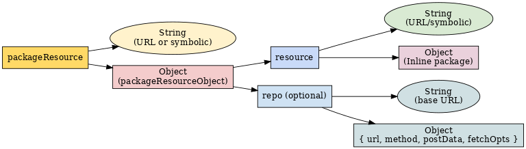

← Back to [Usage Guide Index](TOC.md)

# 📦 Package & Repo Specifications

This section defines the structures used to describe **packages** and **repositories**, including their relationship, valid formats, and resolution rules.

---

## 1. `packageResource`

A `packageResource` is any valid reference to a package that **M7BootStrap** can load.
It can take **three** primary forms:

1. **String** — a direct URL or symbolic resource name
   **Examples:**

   ```js
   "https://example.com/repo/scene/chess.json"
   "scene:chess"
   ```
2. **Object** — a `packageResourceObject`
3. **Inline Package Object** — full package definition included directly in code

---

## 2. `packageResourceObject`

An object form of a package resource.
**Must include:**

* `resource` *(string | object)* — The actual resource to load.
* `repo` *(optional)* — A `repoResource` or array of `repoResource`s.

**Example:**

```json
{
  "resource": "scene:chess",
  "repo": [
    "/repo",
    { "url": "/alt", "method": "POST", "postData": { "foo": "bar" } }
  ]
}
```

---

## 3. `repoResource`

A `repoResource` describes **where and how** to fetch a package.

**Can be:**

1. **String** — base URL for the package

```json
"/repo"
```

2. **Object** — with request metadata:

```json
{
  "url": "/repo",
  "method": "post",          
  "postData": { "foo": "bar" },
  "fetchOpts": { "cache": "no-store" }
}
```

---

## 4. functionResourceObject

A **functionResourceObject** is the normalized representation of a function handler input, ensuring consistent structure and metadata regardless of how the handler was originally specified.

It is produced by parsing a function handler reference, which may be provided as:

* A **direct function reference**
* A **string identifier** (function name or symbolic reference)
* A **configuration object** containing a `fn` field and optional metadata

**Purpose**

By converting any supported handler input into a standardized object, the loader can:

* Identify whether the function is symbolic, package-local, or bootstrapper-local
* Store the original input for reference
* Track binding requirements
* Maintain compatibility across handler formats

**Structure**

A normalized **functionResourceObject** includes at least:

* `fn` — The function reference itself, or a string path to it
* `bind` — Boolean indicating whether the function should be bound to a specific context (true for local `#` references)
* `original` — The original input value as provided by the user
* `symbolic` *(optional)* — True if the function reference is symbolic (prefixed with `@`)
* `local` *(optional)* — True if the reference is bootstrapper-local (prefixed with `#`)
* `pkgLocal` *(optional)* — True if the reference is package-local (prefixed with `~`)

**Examples**

| Input                                          | Normalized Output (key fields only)                                                |
| ---------------------------------------------- | ---------------------------------------------------------------------------------- |
| `"@foo.bar"`                                   | `{ fn: "foo.bar", bind: false, symbolic: true, original: "@foo.bar" }`             |
| `"myFunc"`                                     | `{ fn: "myFunc", bind: false, symbolic: false, original: "myFunc" }`               |
| `() => {}`                                     | `{ fn: [Function], bind: false, original: "anonymous" }`                           |
| `function namedFn() {}`                        | `{ fn: [Function: namedFn], bind: false, original: "namedFn" }`                    |
| `{ fn: "@pkg.fn", bind: true, extra: "meta" }` | `{ fn: "pkg.fn", bind: true, symbolic: true, original: "@pkg.fn", extra: "meta" }` |

---
## 5. Inline Package Structure

An inline package definition is a fully self-contained package object.
When `resource` is an object, **no fetching occurs** — it is treated as already resolved.

**Example:**

```json
{
  "resource": {
    "id": "allpurposemounter",
    "title": "General purpose Mounting tool",
    "assets": [
      {
        "id": "mountinstructions",
        "inline": true,
        "content": { "a": "b", "nums": [1, 2, 3] }
      }
    ],
    "modules": [],
    "run": ["mountusMaximus"]
  }
}
```

---

## 6. Examples of Each Form

**String form**

```js
"scene:chess"
```

**Object + String resource**

```json
{ "resource": "scene:chess", "repo": ["/repo"] }
```

**Object + Inline package**

```json
{ "resource": { "id": "pkg1", "assets": [], "modules": [] } }
```

---

## 7. Resolution Rules

When loading a `packageResource`:

1. **Inline object** — loaded immediately; `repo` is ignored.
2. **String resource + repo** — loader combines repo base URL with resource string. If multiple repos are given, it will try each in sequence until one succeeds.
3. **String resource without repo** — treated as a fully-qualified URL **or** a symbolic name resolved via defaults.
4. **Duplicate detection** — loader normalizes `(type, stem, repos)` to avoid re-fetching the same package.

---

## 8. Relationship Diagram


```
packageResource
 ├─ String  → URL or symbolic name
 └─ Object (packageResourceObject)
      ├─ resource
      │   ├─ String → URL/symbolic + optional repo
      │   └─ Object → Inline package definition
      └─ repo (optional)
           ├─ String  → base URL
           └─ Object  → { url, method, postData, fetchOpts }
```

---

## 9. Validation Notes / Required Fields

* `packageResourceObject.resource` is required and must be string or object.
* **Inline package objects** must have:

  * `id` *(string)* — unique within runtime
  * Optional: `assets` *(array)*, `modules` *(array)*, `run` *(array)*
* `repoResource` objects must have `url` *(string)* if not a plain string.
* Method names (`method`) are normalized to lowercase internally.
* Loader does **not** validate asset/module schema — it trusts package definitions.

---

**See Also**

* **[Loading Packages](LOADING_PACKAGES.md)**
* **[Unmounting Packages](UNMOUNTING_PACKAGES.md)**
* Continue to **[Hooks & Handlers](HOOKS_AND_HANDLERS.md)** to action on your loads and unloads
